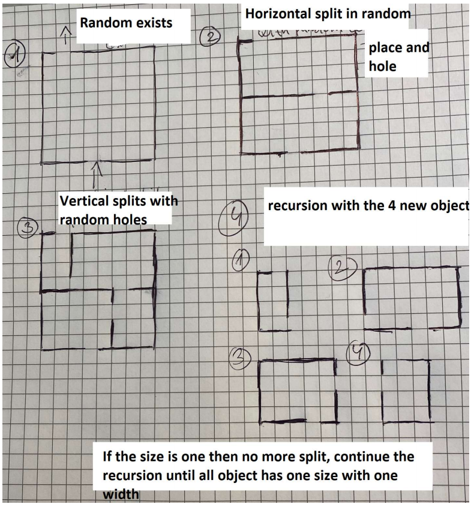

# ACIT_4420_project_labyrinth_solver

Project no. 3 – Labyrinth solver

Create a python project that is able to design a 2D labyrinth and find the exit from any starting point. The program has to accept the following parameters as input:

```
 the size of the labyrinth in both directions
 the starting point for the exit finding
```
The program should provide the following features:

```
 Create a random arbitrary size labyrinth
 Find the way out using brute-force (trying all combinations) and/or using Q learning.
```
For the labyrinth generation, you can use e.g. the following logic:


