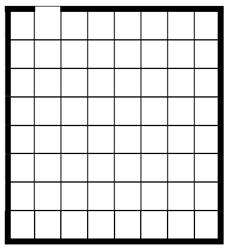
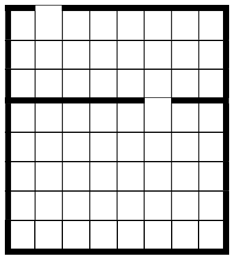
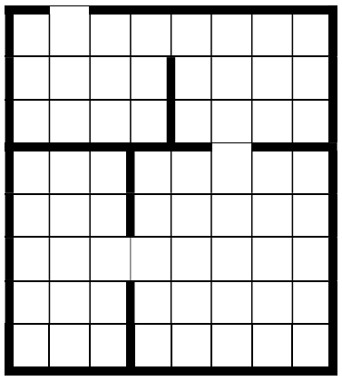
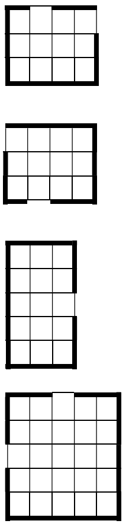

# Maze Generator and Maze Solver

### Candidate no: 249

## Usage 
For running this script, run the main.py file. 

The user has to have the following packages:
- tkinter
- pygame 
- numpy 
- sys
- time
- random 
- enum 

Versions used:
- Windows 10 1909
- python 3.8.6
- tkinter 8.6 
- pygame 1.9.6

## Project no. 3 – Labyrinth solver

Create a python project that is able to design a 2D labyrinth and find the exit from any starting point. The program has to accept the following parameters as input:

- the size of the labyrinth in both directions
- the starting point for the exit finding

The program should provide the following features:

- Create a random arbitrary size labyrinth
- Find the way out using brute-force (trying all combinations) and/or using Q learning.

For the labyrinth generation, you can use e.g. the following algorithm:

1. Set the size of the labyrinth and choose a random exit point.

2. Split the labyrinth with a horizontal line in a random place with a hole (size=1 unit) in a random place.

3. Split the labyrinth vertically in random places with holes.

4. Recursively repeat the process for the new rectangles. If one size of the rectangle is 1 unit then stop the recursive action for that specific rectangle. Repeat the process until all rectangles have a one unit size.

